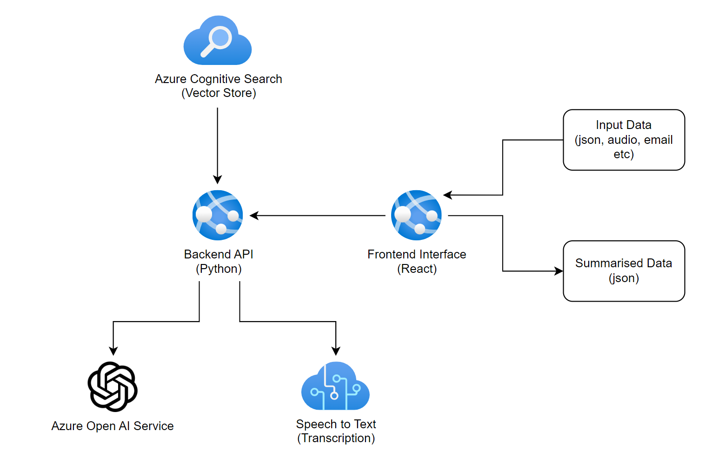

# Telefónica Tech / Microsoft - Local Government Hackathon

## Introduction

This repository aims to provide a starting point for implementing AI use cases at the Local Government Hackathon that has been organised by Telefónica Tech and Microsoft.

The repository implements an architecture made up of the following components:

- **Web Application** - a ReactJS web application that will take an input such as text or an audio file, pass it to an API and return the response
- **API** - a Python FastAPI API that will take an input (text or audio), transcribe audio (if required), pass the data to Azure OpenAI Service and return a response

A diagram of the architecture is provided below:



## Running the Solution

### Software Requirements

The following software must be installed on a machine in order to run the solution:

- Visual Studio Code (https://code.visualstudio.com/)
- Visual Studio Code Python Extension (https://marketplace.visualstudio.com/items?itemName=ms-python.python)
- Python 3.12 (https://www.python.org/ftp/python/3.12.4/python-3.12.4-amd64.exe)
- NodeJS / NPM (https://nodejs.org/en/download/package-manager)
- Azure CLI (https://learn.microsoft.com/en-us/cli/azure/install-azure-cli-windows?tabs=azure-cli)

### Infrastructure

A bicep template is provided to create the required infrastructure in an Azure resource group. This can be executed by running the following CLI command:

```ps
az deployment group create --resource-group rgexample --template-file main.bicep --parameters councilName='councilNameExample'
```
Also you will need to create an Azure AI Foundry resource directly in the RG. All of the default configuration values can be left
Once created, you will need to enter the Azure AI Foundry resource and navigate to the Models + Endpoints tab. From here, deploy two new base models, leaving the names as the default:
- gpt-4o-mini
- text-embedding-ada-002


### Running the Solution

1. Clone the git repository
2. Open two separate VS Code windows - one for the _api_ folder and another for the _frontend_ folder

#### Frontend

1. Navigate to the window opened for the _frontend_ folder
2. Execute `npm install` in the VS Code terminal
3. Execute `npm run dev` in the VS Code terminal
4. Navigate to http://localhost:5173/ in the web browser

#### API

1. Navigate to the window opened for the _api_ folder
2. Create a .env file in the {repo root}/api folder with the following content:

```
AZURE_OPENAI_ENDPOINT = "https://{YOUR OPEN AI ACCOUNT NAME}.openai.azure.com/"
AZURE_OPENAI_API_KEY = "{YOUR OPEN AI KEY}"
AZURE_OPENAI_DEPLOYMENT_NAME = "{YOUR DEPLOYMENT NAME}"
OPENAI_API_VERSION="2024-02-01"
SPEECH_KEY="{YOUR SPEECH TO TEXT KEY}"
SPEECH_REGION="uksouth"
AZURE_EMBEDDINGS_DEPLOYMENT_NAME="{YOUR EMBEDDING MODEL NAME}"
EMBEDDINGS_OPENAI_API_VERSION="2023-05-15"
AZURE_AI_SEARCH_SERVICE_NAME="https://{YOUR AI SEARCH ACCOUNT NAME}.search.windows.net"
AZURE_AI_SEARCH_INDEX_NAME="{YOUR INDEX NAME}"
AZURE_AI_SEARCH_API_KEY="{YOUR AI SEARCH KEY}"
```

3. Execute `pip install -r requirements.txt`
4. Hit <kbd>F5</kbd> to start the debugger
5. Navigate to http://localhost:8000/docs to confirm the API is running